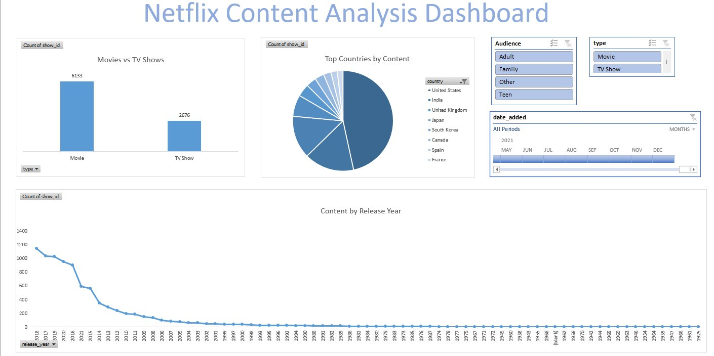

<div align="center">

# 🎬 Netflix Content Analysis Dashboard
### Built entirely in Microsoft Excel — No Code, No BI Tools, Just Pure Excel Power 💪


</div>

---

## 📌 Project Overview

This project is a **fully interactive Excel dashboard** built to analyze Netflix's content library using real-world data. It demonstrates hands-on proficiency in data cleaning, formula engineering, pivot table analysis, and dashboard design — all within Microsoft Excel.

> 🎯 **Goal:** Transform raw Netflix data into actionable, visually compelling insights that any stakeholder can interact with.

---

## 🖥️ Dashboard Preview



---

## 📊 Key Insights at a Glance

| 📌 Metric | 🔢 Value |
|---|---|
| 🎬 Total Titles Analyzed | **8,809** |
| 🎥 Movies | **6,133** |
| 📺 TV Shows | **2,676** |
| 🌍 Top Country | **United States (2,817 titles)** |
| 📅 Peak Year | **2018 (1,147 releases)** |
| 🏆 Top Audience Segment | **Adult (TV-MA)** |

---

## 🗂️ Workbook Structure

The workbook is organized across **4 purpose-built sheets:**

```
📁 Harshal_ExcelDashboard.xlsx
│
├── 📊  Dashboard           → Interactive visual dashboard with slicers & charts
├── 🔄  Pivot Tables & Charts → Source pivot tables powering all visualizations
├── 🧮  Formula Sheet       → VLOOKUP, INDEX-MATCH & Nested IF demonstrations
└── 📋  Raw Data            → Cleaned and enriched Netflix dataset (8,809 rows)
```

---

## 🔧 Excel Skills & Techniques Applied

### 🧹 Data Cleaning & Preparation
- Parsed the `duration` column into two separate columns — **`Duration_Value`** (numeric) and **`Duration_Unit`** (`min` / `Seasons`) — using text functions
- Handled missing `cast` and `country` values with a `cast_helper` and `country_helper` fallback column (defaulting to `"Unknown"`)
- Converted raw `date_added` serial numbers into readable date format

### 🧮 Formula Engineering (`Formula Sheet`)

**VLOOKUP** — Looked up titles by `show_id` to retrieve their names from the raw data table:
```
=VLOOKUP(show_id, raw_data_range, col_index, FALSE)
```

**INDEX-MATCH** — Performed a reverse/flexible lookup to retrieve the `Rating` for a given title:
```
=INDEX(rating_col, MATCH(title, title_col, 0))
```

**Nested IF** — Classified each title into an audience category based on its rating:
```
=IF(rating="TV-MA","Adult", IF(rating="TV-14","Teen", IF(rating="PG","Family", "Other")))
```
> Ratings mapped: `TV-MA` → Adult | `TV-14` → Teen | `PG` / `TV-PG` → Family | All others → Other

### 📊 Pivot Tables & Charts (`Pivot Tables & Charts`)

Three pivot tables were built as the backbone of the dashboard:

| Pivot Table | Rows | Values | Chart Type |
|---|---|---|---|
| Movies vs TV Shows | `type` | Count of `show_id` | 📊 Bar Chart |
| Top Countries by Content | `country` | Count of `show_id` | 🥧 Pie Chart |
| Content by Release Year | `release_year` | Count of `show_id` | 📈 Line Chart |

### 🎛️ Interactive Dashboard (`Dashboard`)

- **Slicers** added for dynamic filtering:
  - `Audience` → Adult / Family / Teen / Other
  - `type` → Movie / TV Show
  - `date_added` → Timeline slicer with month-level granularity (2021)
- All three charts are connected to the slicers for synchronized, one-click filtering
- Clean layout with consistent color theme and labelled chart titles

---

## 🔄 Project Workflow

```
Raw CSV Data
     │
     ▼
┌─────────────────────────────┐
│  Data Cleaning & Enrichment │
│  • Split duration column    │
│  • Fill missing values      │
│  • Classify audience type   │
└────────────┬────────────────┘
             │
             ▼
┌─────────────────────────────┐
│    Formula Engineering      │
│  • VLOOKUP                  │
│  • INDEX-MATCH              │
│  • Nested IF                │
└────────────┬────────────────┘
             │
             ▼
┌─────────────────────────────┐
│   Pivot Tables & Charts     │
│  • Content by Type          │
│  • Top Countries            │
│  • Releases by Year         │
└────────────┬────────────────┘
             │
             ▼
┌─────────────────────────────┐
│   Interactive Dashboard     │
│  • Slicers (Audience, Type) │
│  • Timeline filter          │
│  • Linked pivot charts      │
└─────────────────────────────┘
```

---

## 📁 Files in This Repository

| File | Description |
|---|---|
| `Harshal_ExcelDashboard.xlsx` | Full Excel workbook with dashboard, pivot tables, formulas & raw data |
| `netflix_titles.csv` | Original Netflix dataset used as the data source |
| `dashboard_preview.png` | Screenshot of the completed interactive dashboard |

---

## 💡 What Makes This Project Stand Out

✅ **No external tools** — 100% built in Excel  
✅ **End-to-end workflow** — From raw CSV to polished dashboard  
✅ **Real-world dataset** — 8,809 actual Netflix titles  
✅ **Interactive** — Slicers and timeline allow dynamic exploration  
✅ **Clean formula logic** — Demonstrates VLOOKUP, INDEX-MATCH, and conditional logic  

---

## 👤 Author

**Harshal Vora**

[](https://github.com/HarshalVora86)

---

<div align="center">

⭐ *If you found this project useful, feel free to star the repo!* ⭐

</div>
